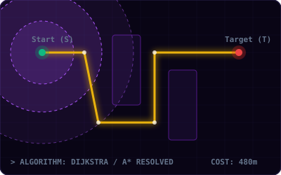
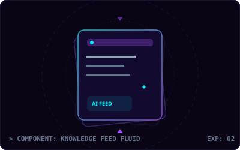
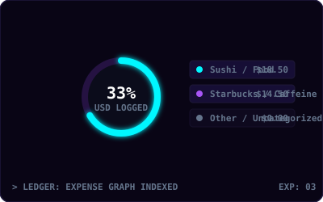
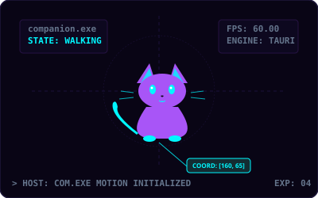

  

<table width="100%" border="0" cellpadding="0" cellspacing="0">
  <tr>
    <td width="30%">
      <pre>
<b>[ LOGISTICS ]</b>
STATUS   : 🟢 ACTIVE
MODE     : ⚡ OBSESSED
LOCATION : 🌐 INTERNET
      </pre>
    </td>
    <td width="40%" align="center">
      <pre>
<b>[ METHODOLOGY ]</b>
IDEA → PROTOTYPE
  ↓          ↑
BREAK  →   FIX
  └─── SHIP ───┘
      </pre>
    </td>
    <td width="30%" align="right">
      <pre>
<b>[ ARCHITECTURE ]</b>
BUILDING > TALKING
FOCUS    : PRODUCTS
VERSION  : 2.1.0
      </pre>
    </td>
  </tr>
</table>

---

# 🚀 PRODUCT SHOWCASE

<table width="100%" border="0" cellpadding="10" cellspacing="0">
  <tr>
    <!-- Project 01: PathLab -->
    <td width="50%" valign="top">
      

        
      

      <h3>01 / PATHLAB &nbsp; <tspan font-weight="300" fill="#64748b" style="font-size: 11px;">[ flagship visualizer ]</tspan></h3>
      
<i>Algorithms meet the real world.</i>

      
An interactive, telemetry-driven shortest path visualizer using real-world road networks and algorithms.

      <pre><b>STACK:</b> Dijkstra · A* · Greedy BFS · OSM API · React · TypeScript</pre>
    </td>
    
    <!-- Project 02: Nexa -->
    <td width="50%" valign="top">
      

        
      

      <h3>02 / NEXA &nbsp; <tspan font-weight="300" fill="#64748b" style="font-size: 11px;">[ mobile learning platform ]</tspan></h3>
      
<i>Scroll, learn, repeat.</i>

      
A vertical-feed mobile application designed to turn learning into a content engine similar to a social feed.

      <pre><b>STACK:</b> React Native · Expo · Gemini APIs · Supabase · Offline Sync</pre>
    </td>
  </tr>
  
  <tr>
    <!-- Project 03: Spendly -->
    <td width="50%" valign="top">
      

        
      

      <h3>03 / Spendly &nbsp; <tspan font-weight="300" fill="#64748b" style="font-size: 11px;">[ active personal finance ]</tspan></h3>
      
<i>Your money, without the spreadsheet.</i>

      
A Gen-Z money coach featuring natural language expense categorization and offline-first budget logs.

      <pre><b>STACK:</b> React Native · Gemini Pro · SQLite · Mobile UI · Offline-first</pre>
    </td>
    
    <!-- Project 04: Nova Engine -->
    <td width="50%" valign="top">
      

        
      

      <h3>04 / NOVA ENGINE &nbsp; <tspan font-weight="300" fill="#64748b" style="font-size: 11px;">[ desktop companion companion ]</tspan></h3>
      
<i>A computer companion.</i>

      
An experimental desktop interactive companion pet using a native Rust core combined with an HTML5 canvas layer.

      <pre><b>STACK:</b> Tauri · Rust · TypeScript · Vite · HTML Canvas · SQLite</pre>
    </td>
  </tr>
</table>

---

# 🧪 RESEARCH &amp; STACK

<table width="100%" border="0" cellpadding="10" cellspacing="0">
  <tr>
    <!-- Experiments Lab -->
    <td width="50%" valign="top">
      <h3>/ LAB</h3>
      <pre>
🧪 <b>AI / LLM &amp; AGENT SYSTEM</b>
🧪 <b>ALGORITHMS &amp; DATA STRUCTURES</b>
🧪 <b>SCALABLE DISTRIBUTED NETWORKS</b>
🧪 <b>INTERACTIVE CANVAS VISUALIZATIONS</b>
🧪 <b>OFFLINE-FIRST MOBILE FLUIDITY</b>
      </pre>
    </td>
    
    <!-- Tech Stack -->
    <td width="50%" valign="top">
      <h3>/ STACK</h3>
      <pre>
⚙️ <b>LANGUAGES</b> : C · Java · Python · TS · Rust · Kotlin
⚙️ <b>BUILDERS</b>  : React · Node · Vite · Expo · Tauri
⚙️ <b>DATABSES</b>  : PostgreSQL · Supabase · SQLite
⚙️ <b>ARSENAL</b>   : Git · Linux · Docker · Vercel · Android
      </pre>
    </td>
  </tr>
</table>

---

<table width="100%" border="0" cellpadding="10" cellspacing="0">
  <tr>
    <!-- Currently status block -->
    <td width="50%" valign="top">
      <h3>/ STATUS</h3>
      <pre>
┌──────────────────────────────────────────────┐
│ <b>CURRENT TARGETS</b>                              │
│                                              │
│ → Learning graph optimization paths          │
│ → Building custom LLM proxy tunnels          │
│ → Experimenting with Rust canvas wrappers    │
│ → Turning ambitious ideas into products      │
│                                              │
│ <b>TELEMETRY:</b> ██████████████████████ 100% BUILD │
└──────────────────────────────────────────────┘
      </pre>
    </td>
    
    <!-- Philosophy Quote -->
    <td width="50%" valign="middle" align="center">
       
      <blockquote>
        
<b>"I don't want to build another Todo App."</b>

        
<b>"I want to build the thing someone says:   'Wait... you actually made that?'"</b>

      </blockquote>
    </td>
  </tr>
</table>

---

# 📡 TELEMETRY ACTIVITY

  
  &nbsp;&nbsp;
  

  

---

  <code><a href="https://github.com/dwarkesh-rana">GITHUB</a></code> &nbsp; | &nbsp; <code><a href="https://linkedin.com/in/dwarkeshrana">LINKEDIN</a></code> &nbsp; | &nbsp; <code><a href="mailto:contact@dwarkesh.dev">EMAIL</a></code>

  LEARN → BUILD → BREAK → FIX → SHIP

